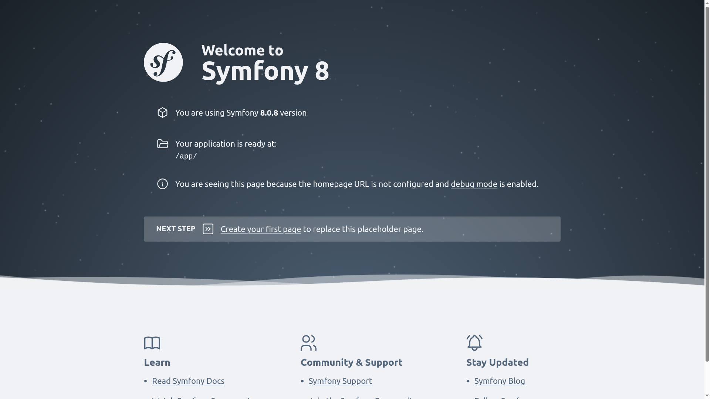
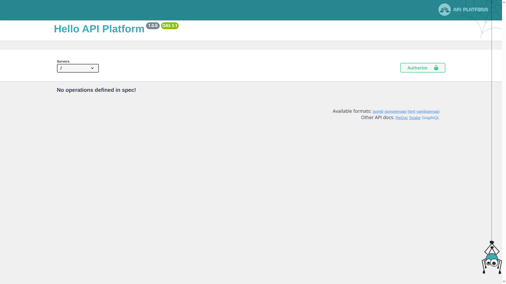
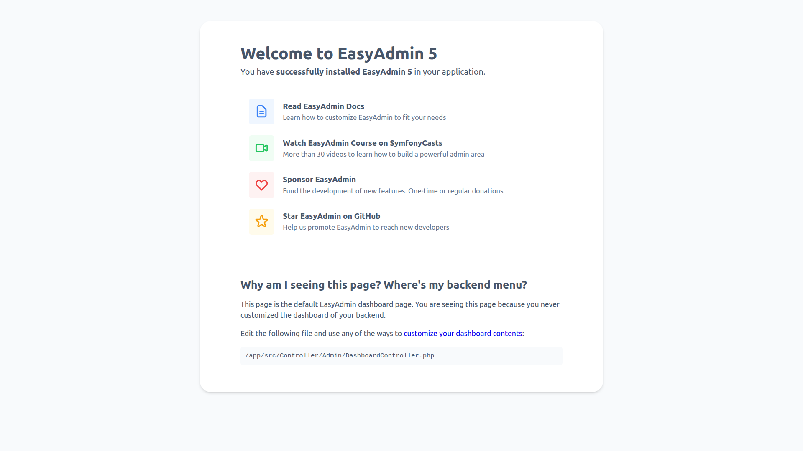
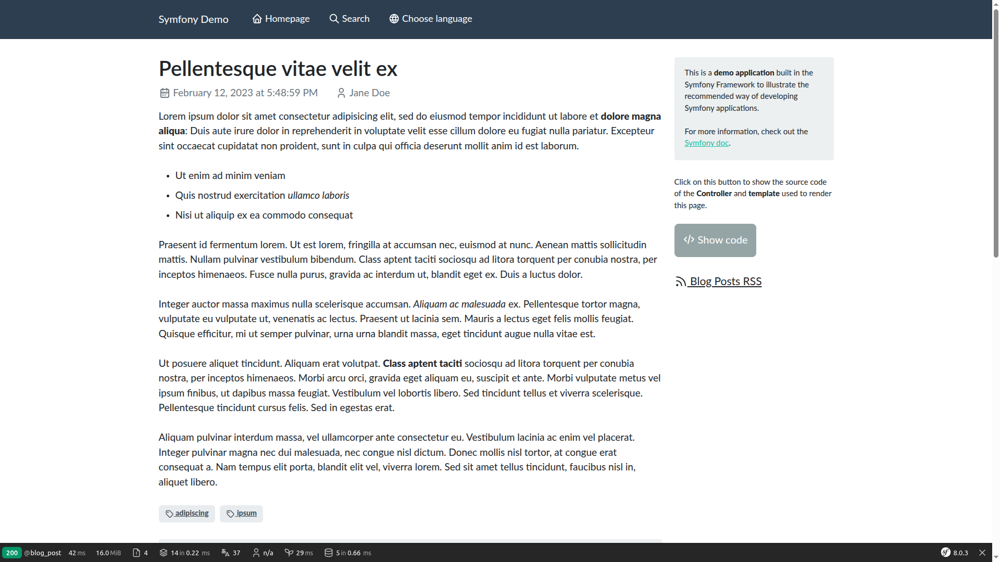

# Symfony Starter - Generate your project

[⬅️ README](../../README.md)

---


**Generate a fully Dockerized Symfony application with a single command.**

From a minimal [Symfony](https://symfony.com/) skeleton to a full [API Platform](https://api-platform.com/) or [EasyAdmin](https://github.com/EasyCorp/EasyAdminBundle) stack, [Symfony Starter](https://github.com/jprivet-dev/symfony-starter) handles the entire setup — Docker, database, dependencies — so you can focus on your code from the first minute. You can also use the official [Symfony Demo](https://github.com/symfony/demo) as a reference for best practices, or [contribute to Symfony Core](contrib.md) in a real Docker environment.

Built on top of [dunglas/symfony-docker](https://github.com/dunglas/symfony-docker) and driven by a powerful Makefile, it covers everything from project initialization to daily development.

|                                                                     |                                                            |
|:--------------------------------------------------------------------|:-----------------------------------------------------------|
| <strong>Symfony</strong><br>   | <strong>API Platform</strong><br>   |
| <strong>EasyAdmin</strong><br> | <strong>Symfony Demo</strong><br> |

## Quick start

1. Be sure to install the latest version of [Docker Engine](https://docs.docker.com/engine/install/).

2. Clone the project:

```shell
git clone git@github.com:jprivet-dev/symfony-starter.git
cd symfony-starter
```

3. And generate...

| Application     | Stable            | LTS                   | Database      |
|-----------------|-------------------|-----------------------|---------------|
| 🌱 Minimalist   | `make minimalist` | `make minimalist@lts` | 🚫 No DB      |
| 🌍 Webapp       | `make webapp`     | `make webapp@lts`     | 🐘 PostgreSQL |
| 🔌 API Platform | `make api`        | `make api@lts`        | 🐘 PostgreSQL |
| ⚡ EasyAdmin     | `make easy_admin` | `make easy_admin@lts` | 🐘 PostgreSQL |
| 🎓 Demo         | `make demo`       | —                     | 🪶 SQLite     |

> [!NOTE]
>
> Each generation takes approximately ⏱️ 3-4 minutes depending on your machine and network speed.

### Contribute to Symfony

Use the starter as a reproducer to contribute to the Symfony framework, any Symfony bundle or
bridge. It lets you mount a local fork directly into the Docker environment and run the test suite
using the reproducer's PHP container (no local PHP installation required).

| Command               | Symfony version                     |
|-----------------------|-------------------------------------|
| `make reproducer`     | Latest stable release               |
| `make reproducer@lts` | Long-term support release           |
| `make reproducer@6x`  | Symfony 6.x (for legacy reproducer) |

📖 [Contributing - Create your reproducer](contrib.md)

## Switch to another DB

> [!NOTE]
>
> By default, **🐘 PostgreSQL** is used. Run one of the following commands after generation to switch to another database.

| Application     | 🐬 MariaDB                                     | 🪶 SQLite                                     |
|-----------------|------------------------------------------------|-----------------------------------------------|
| 🌱 Minimalist   | `make require_orm`<br>`make switch_to_mariadb` | `make require_orm`<br>`make switch_to_sqlite` |
| 🌍 Webapp       | `make switch_to_mariadb`                       | `make switch_to_sqlite`                       |
| 🔌 API Platform | `make switch_to_mariadb`                       | `make switch_to_sqlite`                       |
| ⚡ EasyAdmin     | `make switch_to_mariadb`                       | `make switch_to_sqlite`                       |
| 🎓 Demo         | —                                              | —                                             |

## Generate from scratch

You can switch between flavors or restart from scratch. This will **delete** the current Symfony application and Docker configuration.

```shell
make clean_app  # 1. Nuke the current setup
make easy_admin # 2. Generate a different flavor
```

## Use a source branch directly

If you just want to try the starter without generating it, use one of the pre-built branches:

| Application     | Stable                                                                               | LTS                                                                                          | Database      |
|-----------------|--------------------------------------------------------------------------------------|----------------------------------------------------------------------------------------------|---------------|
| 🌱 Minimalist   | [minimalist](https://github.com/jprivet-dev/symfony-starter/tree/minimalist)         | [minimalist@lts](https://github.com/jprivet-dev/symfony-starter/tree/minimalist@lts)         | 🚫 No DB      |
| 🌍 Webapp       | [webapp](https://github.com/jprivet-dev/symfony-starter/tree/webapp)                 | [webapp@lts](https://github.com/jprivet-dev/symfony-starter/tree/webapp@lts)                 | 🐘 PostgreSQL |

```shell
git fetch origin            # 1. Fetch all branches
git checkout minimalist     # 2. Switch to the desired branch (e.g. minimalist, webapp, webapp@lts)
make clean_app              # 3. Nuke (only if necessary) the current setup
make install                # 4. Install and start
```

> [!TIP]
>
> From there, use `make require_orm`, `make require_api`, `make switch_to_mariadb`, etc. to add more features.

## Documentation

### Main

* [Caddy - Validate certificates](certificates.md)
* [Compose - Accessing the `var/` directory](var.md)
* [Makefile - Discover all commands](makefile.md)
* [Symfony - Save your generated application](save.md)
* [Symfony and Docker - Use build options](options.md)
* [Shell Aliases: Seamless Docker Experience](aliases.md)

### IDE configuration

* [PhpStorm - Configure a remote PHP interpreter (Docker)](ide/phpstorm-remote-php-interpreter.md)
* [PhpStorm - Configure inspections](ide/phpstorm-inspections.md)
* [PhpStorm - Connect it to the running PostgreSQL container](ide/phpstorm-postgre.md)
* [PhpStorm - Connect it to the running MariaDB container](ide/phpstorm-mariadb.md)
* [PhpStorm - Connect it to the SQLite database](ide/phpstorm-sqlite.md)

### Quality

* [PHP_CodeSniffer](quality/phpcodesniffer.md)
* [PHP CS Fixer](quality/phpcsfixer.md)
* [PHP Mess Detector](quality/phpmessdetector.md)
* [PhpMetrics](quality/phpmetrics.md)
* [PHPStan](quality/phpstan.md)
* [Twig CS Fixer](quality/twigcsfixer.md)

### Testing

* [Testing overview](testing/testing-overview.md)
* PHPUnit *(TODO)*
* Behat *(TODO)*

### ADR (Architecture Decision Records)

* [What is an ADR?](adr/what-is-an-adr.md)
* [Database: port mapping strategy](adr/database-port-mapping.md)
* [Makefile: target naming convention](adr/makefile-naming.md)

### Troubleshooting

* [Linux - Editing permissions](troubleshooting/editing-permissions-on-linux.md)
* [Docker - "address already in use" or "port is already allocated"](troubleshooting/address-already-in-use.md)
* [Docker - "container is unhealthy" after `docker compose up`](troubleshooting/unhealthy.md)
* [Docker and Git - "detected dubious ownership in repository"](troubleshooting/dubious-ownership.md)

## Contributing

* [Contributing - Create your reproducer](contrib.md)

---

[⬅️ README](../../README.md)
