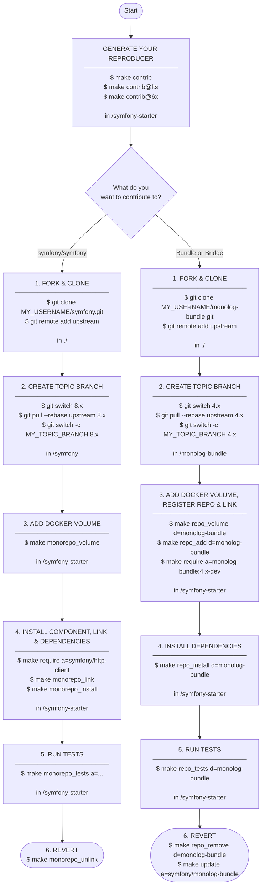

# Contributing - Connect your local Symfony repository

[⬅️ STARTER](STARTER.md)

---

This starter provides a powerful toolkit to help you contribute to the Symfony framework or any
Symfony bundle. It allows you to mount a local repository directly into your Dockerized application
and test your changes immediately.

## Before you start: generate your reproducer

Before contributing to `symfony/symfony` or any Symfony bundle, generate a minimalist Symfony
application configured for contribution:

```shell
# in /symfony-starter

# stable release
make contrib
# or LTS - long-term support release
make contrib@lts
# or Symfony 6.x
make contrib@6x
```

| Command            | Symfony version                       |
|--------------------|---------------------------------------|
| `make contrib`     | Latest stable release                 |
| `make contrib@lts` | Long-term support release             |
| `make contrib@6x`  | Symfony 6.x (for legacy contribution) |

> [!TIP]
>
> If you are contributing to `symfony/symfony`, `make contrib` will ask you whether to add the
> Docker volume for the Symfony monorepo automatically. You can also run `make monorepo_volume`
> manually at any time.

## Contribute to `symfony/symfony`

### 1. Fork and clone side-by-side with the starter

> [!NOTE]
>
> See https://symfony.com/doc/current/contributing/code/pull_requests.html

Fork the [symfony/symfony](https://github.com/symfony/symfony) repository on GitHub. Uncheck
"Copy the `X.Y` branch only", then clone your fork side-by-side with the starter:

```shell
# in ./
git clone git@github.com:MY_USERNAME/symfony.git
cd symfony
git remote add upstream https://github.com/symfony/symfony.git
```

```
./                     <-- run git clone from here
├── symfony/           <-- Your fork
└── symfony-starter/   <-- Your reproducer
```

### 2. Create your topic branch

```shell
# IN /symfony - NOT IN /symfony-starter

# Update an existing branch
git switch 8.x
git pull --rebase upstream 8.x
git switch -c MY_TOPIC_BRANCH 8.x

# Or track a new remote branch
git switch 6.x
git switch -c MY_TOPIC_BRANCH 6.x
```

### 3. Add the Docker volume for the Symfony monorepo

This mounts your local `../symfony` fork into the container, allowing you to use the
reproducer's PHP container as the PHP interpreter for the Symfony monorepo.

> [!NOTE]
>
> If you answered `Y` during `make contrib`, this step has already been done. Skip to step 4.

```shell
# in /symfony-starter
make monorepo_volume
```

### 4. Install the component, link the monorepo and install its dependencies

e.g. [HTTP Client](https://symfony.com/doc/current/http_client.html):

```shell
# in /symfony-starter

# 1. install the component you wish to contribute
# e.g. composer require symfony/http-client (via docker compose)
make require a=symfony/http-client

# 2. link the monorepo into your application's vendors
make monorepo_link

# 3. install the external dependencies used during the tests
make monorepo_install
```

### 5. Run the tests for the first time to verify everything is working

e.g. [HTTP Client](https://symfony.com/doc/current/http_client.html):

```shell
# in /symfony-starter
make monorepo_tests a="/symfony/src/Symfony/Component/HttpClient"
```

> [!NOTE]
>
> Tests are run inside the reproducer's PHP container using absolute paths from the container's
> root (e.g. `/symfony/src/...`).

**Pro-tip:** When running large test suites, you can exclude the integration group, which requires
additional infrastructure (e.g. Redis or RabbitMQ), by appending the `--exclude-group` argument:

```shell
# in /symfony-starter
make monorepo_tests a="/symfony/src/Symfony/Bundle --exclude-group=redis"
```

PHPUnit cache and temporary files are automatically cleaned before each test run.
If you need to clean them manually:

```shell
# in /symfony-starter
make monorepo_tests_clean
```

### 6. Revert: unlink the monorepo

```shell
# in /symfony-starter
make monorepo_unlink
```

## Contribute to a Symfony bundle or bridge

This section uses the [MonologBundle](https://github.com/symfony/monolog-bundle) as an example.
The same workflow applies to any Symfony bundle or bridge hosted in its own repository, outside
the `symfony/symfony` monorepo.

### 1. Fork and clone side-by-side with the starter

> [!NOTE]
>
> See https://github.com/symfony/monolog-bundle

```shell
# in ./
git clone git@github.com:MY_USERNAME/monolog-bundle.git ../monolog-bundle
cd ../monolog-bundle
git remote add upstream https://github.com/symfony/monolog-bundle.git
```

```
./
├── symfony-starter/   <-- Your reproducer
└── monolog-bundle/    <-- Your fork
```

### 2. Create your topic branch

```shell
# IN /monolog-bundle - NOT IN /symfony-starter

# Update an existing branch
git switch 4.x
git pull --rebase upstream 4.x
git switch -c MY_TOPIC_BRANCH 4.x

# Or track a new remote branch
git switch 3.x
git switch -c MY_TOPIC_BRANCH 3.x
```

### 3. Add the Docker volume, register the path repository and link the local version

```shell
# in /symfony-starter
make repo_volume d=monolog-bundle
make repo_add d=monolog-bundle
make require a="symfony/monolog-bundle:4.x-dev --prefer-source"
```

> [!TIP]
>
> Composer expects a version following the `[branch-name]-dev` pattern. If your local branch is
> named `main`, use `main-dev`; if it's `4.x`, use `4.x-dev`.

### 4. Install the external dependencies used during the tests

```shell
# in /symfony-starter
make repo_install d=monolog-bundle
```

### 5. Run the tests for the first time to verify everything is working

```shell
# in /symfony-starter
make repo_tests d=monolog-bundle
```

PHPUnit cache and temporary files are automatically cleaned before each test run.
If you need to clean them manually:

```shell
# in /symfony-starter
make repo_tests_clean d=monolog-bundle
```

### 6. Revert: remove the path repository and restore the published package

> [!TIP]
>
> Once your changes are ready to submit as a pull request, or if you want to switch back to the
> published version of the package, remove the local path repository.

```shell
# in /symfony-starter
make repo_remove d=monolog-bundle
make update a=symfony/monolog-bundle
```

## Workflow overview



## Personal shortcuts

If you are working frequently on specific components, you can create your own shortcuts. The
starter includes a mechanism to load local Makefile rules that are not committed to the repository.

### 1. Create your local Makefile

```shell
cp .make/local.mk.dist .make/local.mk
```

### 2. Add your custom commands to `.make/local.mk`

These will automatically appear in `make help`. Here are some useful examples you can use:

```makefile
monorepo_tests_bridge: ## Run tests for all Bridge components
	$(MAKE) monorepo_tests a="/symfony/src/Symfony/Bridge"

monorepo_tests_bundle: ## Run tests for all Bundle components
	$(MAKE) monorepo_tests a="/symfony/src/Symfony/Bundle"

monorepo_tests_component: ## Run tests for all Components
	$(MAKE) monorepo_tests a="/symfony/src/Symfony/Component"

monorepo_tests_di: ## Run tests for DependencyInjection
	$(MAKE) monorepo_tests a="/symfony/src/Symfony/Component/DependencyInjection"

monorepo_tests_doctrine: ## Run tests for DoctrineBridge
	$(MAKE) monorepo_tests a="/symfony/src/Symfony/Bridge/Doctrine"

monorepo_tests_eventdispatcher: ## Run tests for EventDispatcher
	$(MAKE) monorepo_tests a="/symfony/src/Symfony/Component/EventDispatcher"

monorepo_tests_form: ## Run tests for Form
	$(MAKE) monorepo_tests a="/symfony/src/Symfony/Component/Form"

monorepo_tests_httpfoundation: ## Run tests for HttpFoundation
	$(MAKE) monorepo_tests a="/symfony/src/Symfony/Component/HttpFoundation"

monorepo_tests_httpkernel: ## Run tests for HttpKernel
	$(MAKE) monorepo_tests a="/symfony/src/Symfony/Component/HttpKernel"

monorepo_tests_routing: ## Run tests for Routing
	$(MAKE) monorepo_tests a="/symfony/src/Symfony/Component/Routing"

monorepo_tests_security: ## Run tests for SecurityBundle
	$(MAKE) monorepo_tests a="/symfony/src/Symfony/Bundle/SecurityBundle"

monorepo_tests_twig: ## Run tests for TwigBridge
	$(MAKE) monorepo_tests a="/symfony/src/Symfony/Bridge/Twig"
```

> [!TIP]
>
> The `.make/local.mk` file is ignored by Git. This is the perfect place to experiment with new
> commands before potentially proposing them as a permanent addition to the project.

---

[⬅️ STARTER](STARTER.md)
