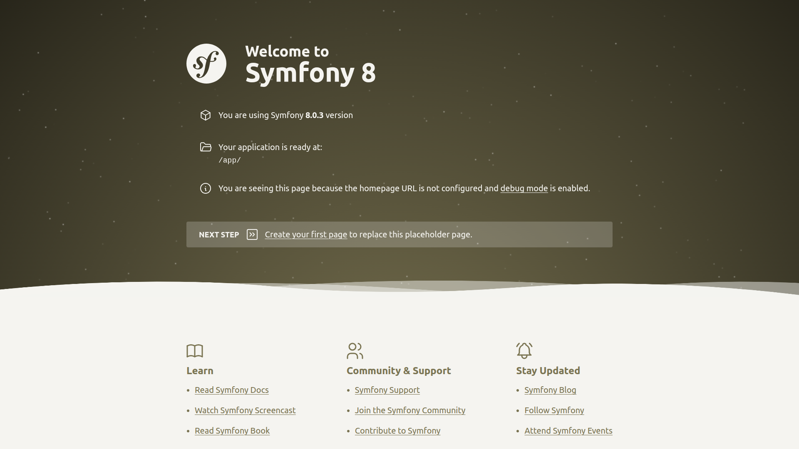
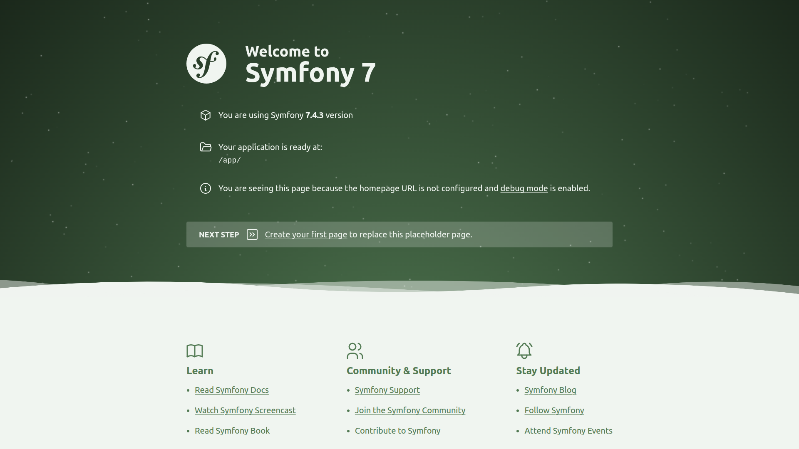
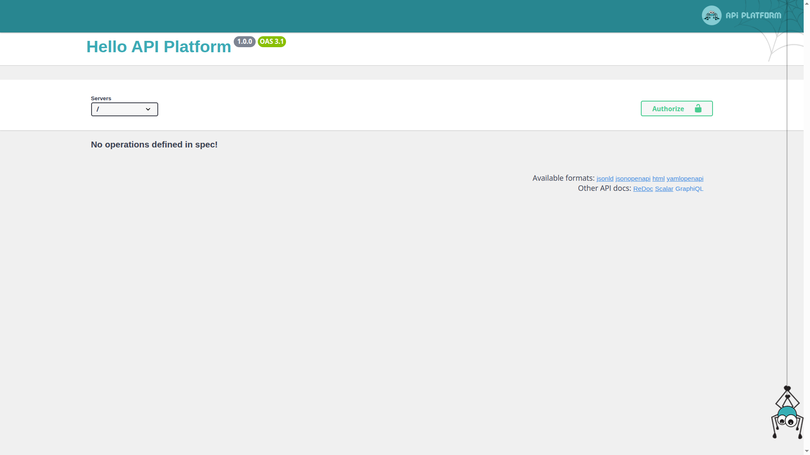
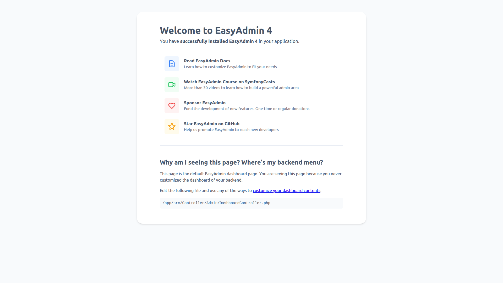
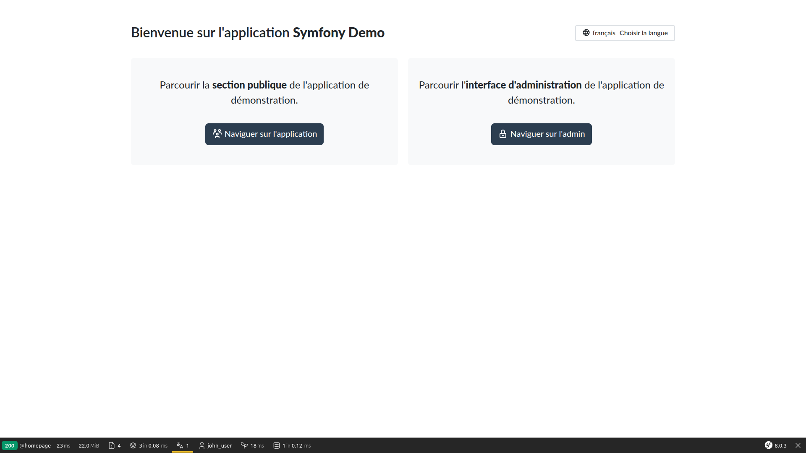

# 🐳 🎵 Symfony Starter

**Generate a fully Dockerized Symfony application in seconds.**

Whether you want to instantly test a **Stable or LTS** version of Symfony, API Platform or EasyAdmin, validate your **framework contributions** in a real environment, or start a **client project** with robust, documented tooling: **Symfony Starter is the solution you need**.

It leverages the power of [dunglas/symfony-docker](https://github.com/dunglas/symfony-docker) combined with a powerful Makefile to manage the entire lifecycle.

## ⚡ What can you do with this Starter?

This project is designed to handle the entire lifecycle of a Symfony project, from initialization to daily development.

### 1. 🏗️ Scaffolding & Initialization

* **Instant Setup:** Bootstrap a Dockerized project in seconds: [Minimalist](#minimalist), [Web App](#web-app), [API Platform](#api-platform), [EasyAdmin](#easyadmin) or [Demo](#demo).
* **Database Agnostic:** The starter comes with **PostgreSQL** by default but offers commands to easily switch to **MySQL/MariaDB** or **SQLite** configuration.

### 2. 🧰 Daily Workflow

* **Powerful Makefile:** Forget complex Docker commands. Use a standardized set of commands (`make start`, `make db_init`, `make tests`) to manage your stack.
* **Transparent History:** Every generation step is committed to Git (🤖 `[starter]`), giving you a full audit trail of the installation process.

### 3. 🧩 Ecosystem & Quality

* **IDE Ready:** Comprehensive documentation to configure **PhpStorm** perfectly:
  * [Connect Docker PHP Interpreter](docs/remote-php-interpreter.md)
  * [Connect to the Database](docs/postgre.md)
* **Quality Assurance:** Pre-configured tools to maintain high code quality from day one (PHPStan, CS Fixer, Tests).

### 4. 🤝 Contributing to Symfony Core

* **Seamless Local Linking:** Easily mount your local `symfony/symfony` repository into the container.
* **Real-world Testing:** Test your pull requests and framework modifications against a running application instantly without complex configuration.
* **[📖 Read the Contribution Guide](docs/contributing.md)**

## ✨ Available Flavors

You can choose from several pre-configured setups.

<table>
    <thead>
    <tr>
        <th>Flavor & Description</th>
        <th width="300">Preview</th>
    </tr>
    </thead>
    <tbody>
    <tr>
        <td>
            <h3>Minimalist</h3>
            <p>A bare-bones <strong>Symfony skeleton</strong>. Perfect for starting from scratch.</p>
            <ul>
                <li>Doc: <a href="https://symfony.com/doc/current/setup.html">Installing & Setting up the Symfony Framework</a></li>
                <li>
                    <span>Stable version (branch: <a href="https://github.com/jprivet-dev/symfony-starter/tree/minimalist">minimalist</a>):</span>
                    <pre>make minimalist</pre>
                </li>
                <li>
                    <span>LTS version (branch: <a href="https://github.com/jprivet-dev/symfony-starter/tree/minimalist@lts">minimalist@lts</a>):</span>
                    <pre>make minimalist@lts</pre>
                </li>
            </ul>
        </td>
        <td>
            
            <br><br>
            
        </td>
    </tr>
    <tr>
        <td>
            <h3>Web App</h3>
            <p><strong>Full stack application</strong> with Twig, AssetMapper, Profiler, etc.</p>
            <ul>
                <li>Doc: <a href="https://symfony.com/doc/current/setup.html">Installing & Setting up the Symfony Framework</a></li>
                <li>
                    <span>Stable version (branch: <a href="https://github.com/jprivet-dev/symfony-starter/tree/webapp">webapp</a>):</span>
                    <pre>make webapp</pre>
                </li>
                <li>
                    <span>LTS version (branch: <a href="https://github.com/jprivet-dev/symfony-starter/tree/webapp@lts">webapp@lts</a>):</span>
                    <pre>make webapp@lts</pre>
                </li>
            </ul>
        </td>
        <td align="center"><em>(Same as Minimalist)</em></td>
    </tr>
    <tr>
        <td>
            <h3>API Platform</h3>
            <p>Includes <strong>API Platform</strong> and <strong>PostgreSQL</strong>. Ready for REST/GraphQL.</p>
            <ul>
                <li>Doc: <a href="https://api-platform.com/docs/symfony/">Getting Started With API Platform with Symfony</a></li>
                <li>
                    <span>Stable version: <strong>Not available</strong></span>
                </li>
                <li>
                    <span>LTS version (branch: <a href="https://github.com/jprivet-dev/symfony-starter/tree/api@lts">api@lts</a>):</span>
                    <pre>make api@lts</pre>
                </li>
            </ul>
        </td>
        <td></td>
    </tr>
    <tr>
        <td>
            <h3>EasyAdmin</h3>
            <p>Includes <strong>EasyAdmin</strong> and <strong>PostgreSQL</strong>. The quickest back-office.</p>
            <ul>
                <li>Doc: <a href="https://symfony.com/bundles/EasyAdminBundle/current/index.html">EasyAdmin</a></li>
                <li>
                    <span>Stable version (branch: <a href="https://github.com/jprivet-dev/symfony-starter/tree/easy_admin">easy_admin</a>):</span>
                    <pre>make easy_admin</pre>
                </li>
                <li>
                    <span>LTS version (branch: <a href="https://github.com/jprivet-dev/symfony-starter/tree/easy_admin@lts">easy_admin@lts</a>):</span>
                    <pre>make easy_admin@lts</pre>
                </li>
            </ul>
        </td>
        <td></td>
    </tr>
    <tr>
        <td>
            <h3>Demo</h3>
            <p>The official <strong>Symfony Demo</strong> application (SQLite). Great for learning.</p>
            <ul>
                <li>Doc: <a href="https://github.com/symfony/demo">Symfony Demo Application</a></li>
                <li>
                    <span>Stable version (branch: <a href="https://github.com/jprivet-dev/symfony-starter/tree/demo">demo</a>):</span>
                    <pre>make demo</pre>
                </li>
                <li>
                    <span>LTS version: <strong>Not available</strong></span>
                </li>
            </ul>
        </td>
        <td></td>
    </tr>
    </tbody>
</table>

## 🚀 Prerequisites

Be sure to install the latest version of [Docker Engine](https://docs.docker.com/engine/install/).

## 🛠️ Usage

There are two ways to use this starter:

### Method 1: The Generator (Recommended for new projects)

Clone the main repository and generate the application you need on the fly.

#### Step 1. Clone the repository

```shell
git clone git@github.com:jprivet-dev/symfony-starter.git
cd symfony-starter
```

#### Step 2. Generate your application

```shell
# Example: Generate a full Web App (Stable)
make webapp

# Example: Generate an API Platform project (LTS)
make api@lts

# Example: Generate a specific Minimalist Version
SYMFONY_VERSION=6.4.3 make minimalist
```

> This will:
> * Clone and extract `dunglas/symfony-docker` configuration files.
> * Build the necessary Docker images and start the containers.
> * Generate a fresh Symfony application inside the container.
> * Eventually add extra packages (API Platform, Admin, etc.) depending on the chosen flavor.
>

#### Step 3. Access the app

Open `https://symfony-starter.localhost:8443/` in your browser and [accept the auto-generated TLS certificate](https://stackoverflow.com/a/15076602/1352334).

> See [Caddy - Validate certificates](docs/certificates.md)

### Method 2: The Snapshot (Fastest start)

If you just want to test a specific configuration immediately without waiting for the generation process, checkout the specific branch.

#### Step 1. Clone and checkout

```shell
git clone git@github.com:jprivet-dev/symfony-starter.git
cd symfony-starter

# Switch to the desired flavor
git checkout webapp
```

#### Step 2. Install and Start

```shell
make install
```

## 🔄 Switching Flavors & Cleanup

You can easily switch between flavors or restart from scratch using the cleanup command. This will **delete** the current Symfony application and Docker configuration to allow a fresh generation.

```shell
# 1. Nuke the current setup (Containers, Volumes, Source code)
make kill_current_app

# 2. Generate a different flavor
make easy_admin
```

## 🧰 Developer Toolkit

This starter is a **daily companion**.
It embeds a robust `Makefile` to abstract complex Docker/Composer commands, speeding up your workflow.

Here is a glimpse of what's included:

| Category        | Key Commands               | Description                                                             |
|:----------------|:---------------------------|:----------------------------------------------------------------|
| **🐳 Docker**   | `make start` / `make stop` | Start/Stop the stack (detached mode).                                   |
|                 | `make sh`                  | Access the PHP container shell.                                 |
|                 | `make logs`                | View live logs from all containers.                                     |
| **🚀 Symfony**  | `make cc`                  | Clear the cache (`cache:clear`).                                        |
|                 | `make symfony c="..."`     | Run any Symfony command (e.g. `make symfony c="debug:router"`). |
| **🐘 Database** | `make db_init`             | Create DB, run migrations and load fixtures in one go.                  |
|                 | `make migration`           | Generate a new migration file.                                          |
| **✅ Quality**   | `make tests`               | Run PHPUnit tests.                                              |
|                 | `make phpmd`               | Run PHP Mess Detector.                                          |
| **🎨 Assets**   | `make assets`              | Generate all assets.                                            |

> 💡 **Tip** 
> * Just run `make` (or `make help`) in your terminal to see the beautiful, self-documented list of **30+ available commands**.
> * See [Makefile documentation](docs/makefile.md) for details.

## 🏗️ Project Structure

After `make minimalist`, your project structure will look like this:

```
./
├── bin/                 (*)
├── config/              (*)
├── docs/
├── frankenphp/          (*)
├── public/              (*)
├── src/                 (*)
├── var/                 (*)
├── vendor/              (*)
├── compose.override.yaml(*)
├── compose.prod.yaml    (*)
├── composer.json        (*)
├── composer.lock        (*)
├── compose.yaml         (*)
├── Dockerfile           (*)
├── LICENSE
├── Makefile
├── README.md
└── symfony.lock         (*)
```

**(*)** Indicates files/directories generated or copied from `dunglas/symfony-docker` or `symfony/skeleton`.

To visualize your structure (requires `tree` command):

```shell
tree -A -L 1 -F --dirsfirst
```

## 🔍 Traceable Generation Process

The `Makefile` commits every significant step of the generation process (applying patches, modifying configuration, installing bundles). This creates a clean, readable Git history that lets you understand exactly how your application was constructed.

**Example of a generated `git log`:**

```text
🤖 [starter] make git_apply f=common/docker-entrypoint-clean-composer.patch
🤖 [starter] make build up_detached
🤖 [starter] make yq_update f=compose.yaml k=services.php.environment.DATABASE_URL v=${DATABASE_URL}
🤖 [starter] make yq_add f=compose.override.yaml k=services.php.volumes v=./var/log:/app/var/log
🤖 [starter] make yq_add f=compose.override.yaml k=services.php.volumes v=./var:/app/var
🤖 [starter] make clone_symfony_docker
Initial commit
```

**Benefits:**

* **Audit:** You see exactly which files were modified by the starter.
* **Safety:** You can easily revert a specific step if a patch conflicts with your needs.
* **Learning:** It helps understand the integration between Docker and Symfony.

**Check the git history of these branches to see it in action:**

* **Stable:** [minimalist](https://github.com/jprivet-dev/symfony-starter/tree/minimalist) | [webapp](https://github.com/jprivet-dev/symfony-starter/tree/webapp) | [easy_admin](https://github.com/jprivet-dev/symfony-starter/tree/easy_admin) | [demo](https://github.com/jprivet-dev/symfony-starter/tree/demo)
* **LTS:** [minimalist@lts](https://github.com/jprivet-dev/symfony-starter/tree/minimalist@lts) | [webapp@lts](https://github.com/jprivet-dev/symfony-starter/tree/webapp@lts) | [api@lts](https://github.com/jprivet-dev/symfony-starter/tree/api@lts) | [easy_admin@lts](https://github.com/jprivet-dev/symfony-starter/tree/easy_admin@lts)

## 📚 Documentation

**🐳 Docker & Configuration**

* [Caddy - Validate certificates](docs/certificates.md)
* [Compose - Accessing the `var/` directory](docs/var.md)
* [Makefile - Discover all commands](docs/makefile.md)
* [Symfony - Save your generated application](docs/save.md)
* [Symfony and Docker - Use build options](docs/options.md)

**🐘 Database**

* [PhpStorm - Connect it to PostgreSQL](docs/postgre.md)
* *Switching to MySQL/MariaDB (Coming soon)*
* *Switching to SQLite (Coming soon)*

**💻 IDE & Quality (DX)**

* [PHP - Quality Tools (PHPStan, CS Fixer, etc.)](docs/quality.md)
* [PHP - Testing (PHPUnit)](docs/testing.md)
* [PhpStorm - Configure Remote PHP Interpreter](docs/remote-php-interpreter.md)

**🔧 Advanced**

* [ADR (Architecture Decision Records)](docs/adr.md)
* [Link local Symfony Repository](docs/contribute.md)
* [Troubleshooting](docs/troubleshooting.md)

**🤝 Contributing**

* [Contributing to Symfony Core](docs/contributing.md)

## 🔗 Main links

* https://symfony.com/doc/current/setup/docker.html
* https://github.com/dunglas/symfony-docker
* https://github.com/jprivet-dev/symfony-docker

## 📝 Comments, suggestions?

Feel free to make comments/suggestions to me in the [Git issues section](https://github.com/jprivet-dev/symfony-starter/issues).

## 🤝 Credits & License

* Based on [dunglas/symfony-docker](https://github.com/dunglas/symfony-docker).
* This project is released under the [**MIT License**](https://github.com/jprivet-dev/symfony-starter/blob/main/LICENSE).

