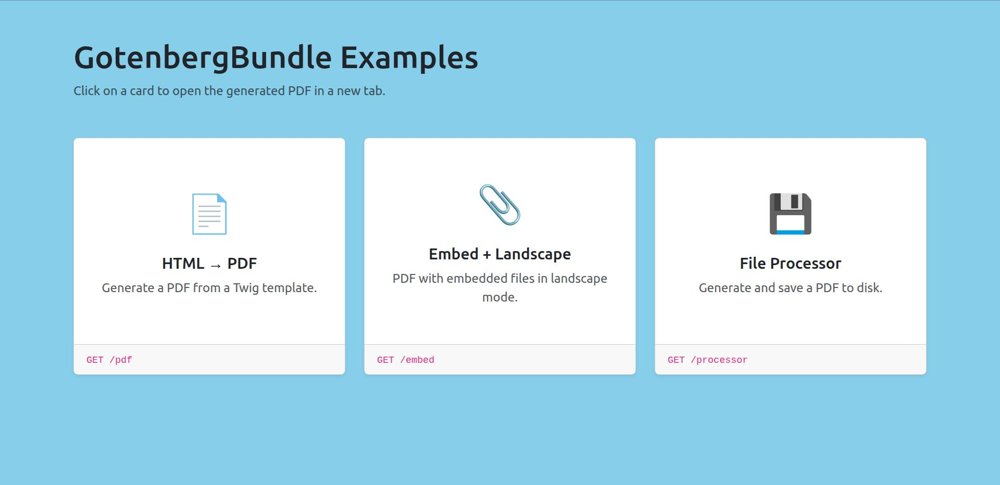
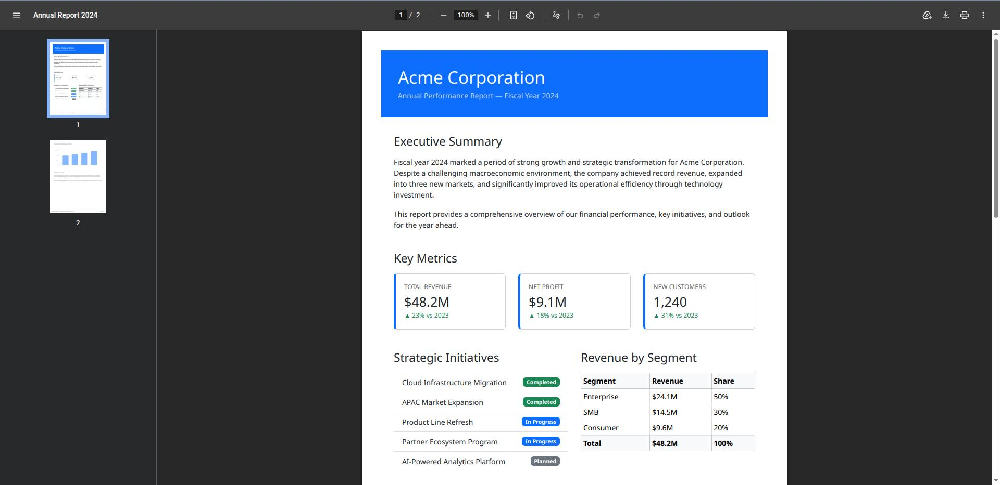

# Contribution reproducer

## Prerequisites

Be sure to install the latest version of:

* [Docker Engine](https://docs.docker.com/engine/install/).
* [Dagger](https://docs.dagger.io/install) (on the host machine, for full CI checks).

## Installation

### 1. Clone the project

Clone this repository and your fork side-by-side:

```shell
git clone git@github.com:jprivet-dev/symfony-starter.git --branch reproducer/gotenberg-bundle/sf6.4
git clone git@github.com:jprivet-dev/GotenbergBundle.git
```

> [!NOTE]
>
> Fork [sensiolabs/GotenbergBundle](https://github.com/sensiolabs/GotenbergBundle) first, then clone your own fork.

### 2. Install the app

```shell
cd symfony-starter
make install
```

### 3. Install bundle dependencies

```shell
make gotenberg_install
```

### 4. Go on the app

Go to https://symfony-starter.localhost:8442/ and accept [the auto-generated TLS certificate](https://stackoverflow.com/a/15076602/1352334) on first visit.

|                                                              |                                                                   |
|:-------------------------------------------------------------|:------------------------------------------------------------------|
|  |                |

> [!TIP]
>
> By default, the app runs on port `8442`. Two ways to change it:
>
> * **Fixed ports:** set `HTTP_PORT` and `HTTPS_PORT` in `.env.local` (e.g. `HTTPS_PORT=9443`).
> * **Auto ports:** set `HTTP_PORTS_AUTO=true` in `.env.local` to derive ports from the project name (avoids conflicts between projects).
>
> Run `make restart` to apply, then `make info` to see the current URLs.

## Makefile daily usage

```shell
make install              # Start the project, install dependencies and show info
make start                # Start the project and show info (detached mode)
make stop                 # Stop the project (down)
make info                 # Show project access info (URLs, ports)
make gotenberg_install    # Install bundle dependencies and initialize Dagger
make gotenberg_tests      # Run PHPUnit tests
make gotenberg_coverage   # Generate HTML coverage report
make dagger_all           # Run all Dagger checks (cs-fixer, phpstan, deps, docs, phpunit)
```

> [!NOTE]
>
> Run `make` to see all available commands ([makefile.md](.starter/docs/makefile.md)).

## Documentation

* 📖 [The Project documentation](docs/README.md).
* 🚀 [The Symfony Starter documentation](.starter/docs/README.md).

## References

* Generated with [jprivet-dev/symfony-starter](https://github.com/jprivet-dev/symfony-starter).
* Built on top of [dunglas/symfony-docker](https://github.com/dunglas/symfony-docker).

## Comments, suggestions?

Feel free to make comments/suggestions in the [Git issues section](https://github.com/jprivet-dev/symfony-starter/issues).

## License

This project is released under the [**MIT License**](https://github.com/jprivet-dev/symfony-starter/blob/main/LICENSE).
